# Court Click Movies

A Netflix-styled movie discovery app built in Flutter on top of [TMDB](https://www.themoviedb.org/)'s API.

The basic architecture, layering and core logic (BLoC wiring, API layer, DI setup, screen composition) in this project were designed and hand-written from scratch to a Figma reference, rather than pulled from a template or boilerplate generator.

## Screens

1. Splash
2. Profile Select ("Who's watching")
3. Home
4. Search
5. Coming Soon
6. Downloads
7. More

## APK

A prebuilt release APK is included at [`release/court-click-movies.apk`](release/court-click-movies.apk) — install it directly on any Android device.

## Screenshots

<table>
<tr>
<td width="33%">

**Splash**

The Netflix wordmark on a pure black background, auto-advancing to Profile Select after 2 seconds.

</td>
<td width="33%">

**Profile Select**

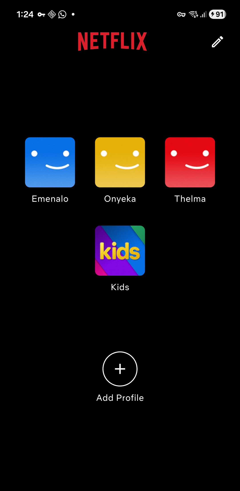

"Who's watching" style profile picker — 4 hardcoded profiles plus an Add Profile action, tap any avatar to enter.

</td>
<td width="33%">

**Home**

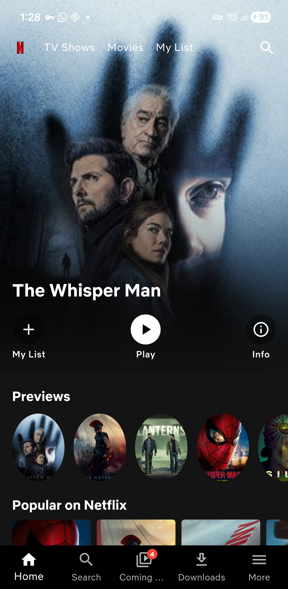

Full-bleed collapsing banner (`SliverAppBar` + `FlexibleSpaceBar`) with a gradient scrim, Play/My List/Info actions, and a circular "Previews" rail underneath.

</td>
</tr>
<tr>
<td width="33%">

**Home — loading shimmer**

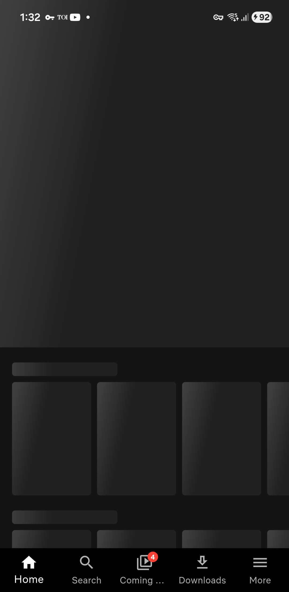

Skeleton placeholders (`shimmer` package) shown on first load instead of a bare spinner, matching the shape of the banner and movie rows.

</td>
<td width="33%">

**Home — rows**

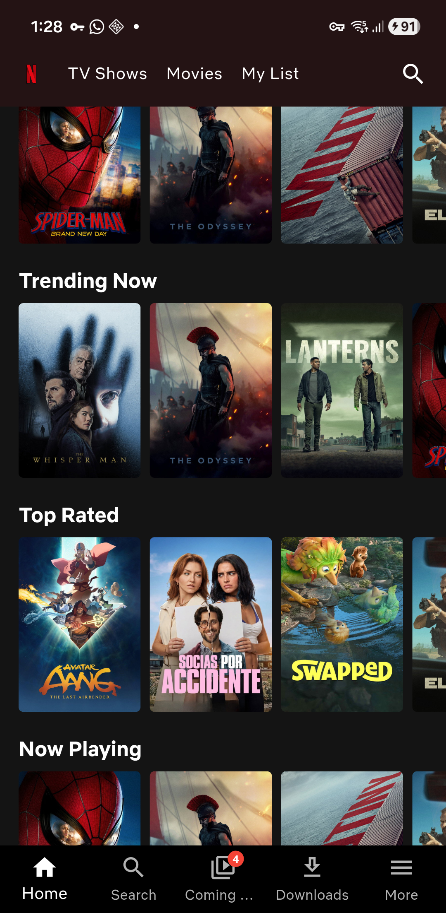

Scrolled further down: Popular on Netflix, Trending Now, Top Rated and Now Playing, each an independent horizontally-scrolling rail pulling from a different TMDB endpoint.

</td>
<td width="33%">

**Search — empty state**

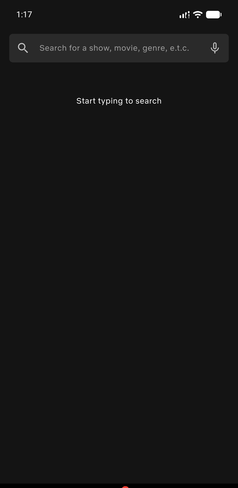

Autofocused search field with a "Start typing to search" placeholder before any query is entered.

</td>
</tr>
<tr>
<td width="33%">

**Search — loading**

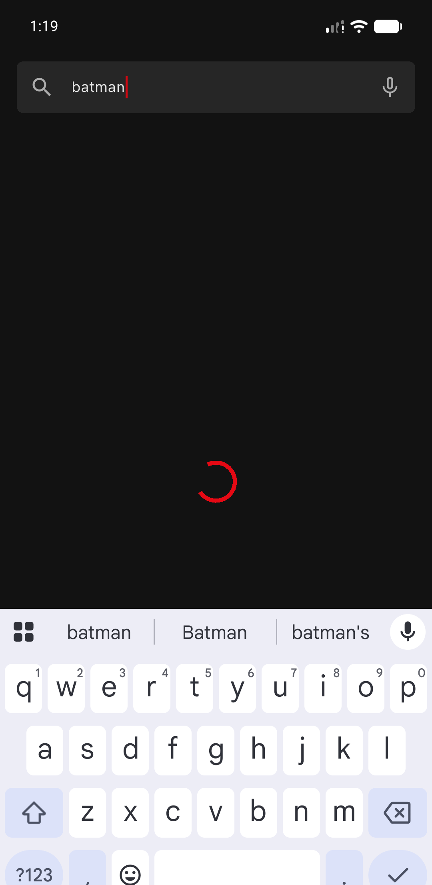

A ~400ms debounce delays each keystroke's API call; a spinner shows while the in-flight request resolves.

</td>
<td width="33%">

**Search — results**

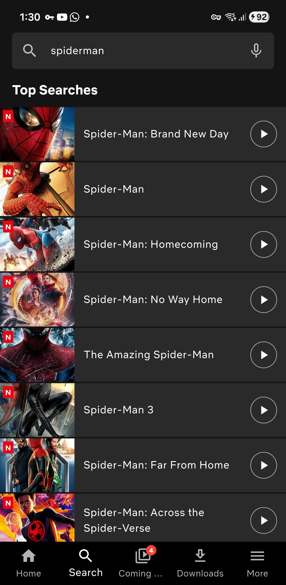

"Top Searches" list rendered from the live TMDB response, each row with a poster thumbnail, "N" badge and play affordance.

</td>
<td width="33%">

**Search — typing**

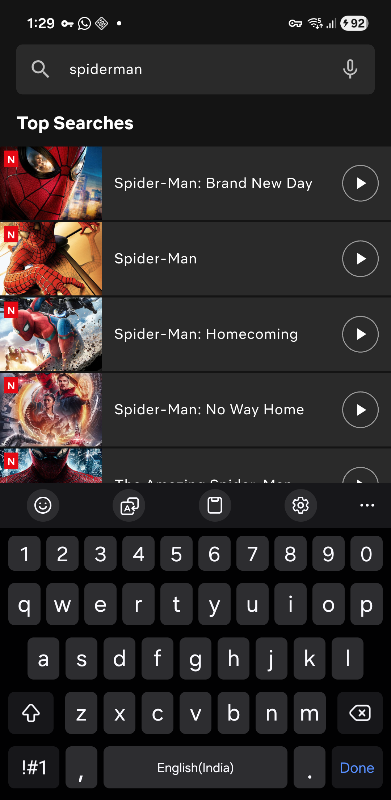

Live results updating in place as the query narrows, keyboard and results visible together.

</td>
</tr>
<tr>
<td width="33%">

**Search — no results**

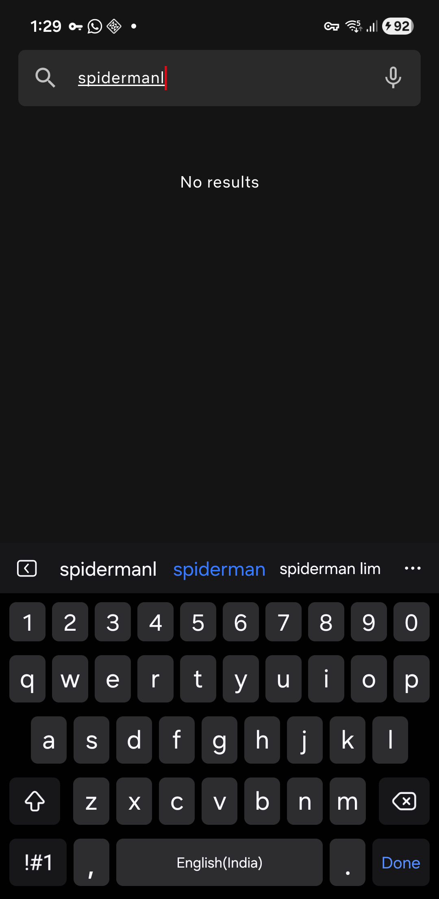

Graceful empty state for a query that matches nothing on TMDB, instead of a blank screen.

</td>
<td width="33%">

**Coming Soon**

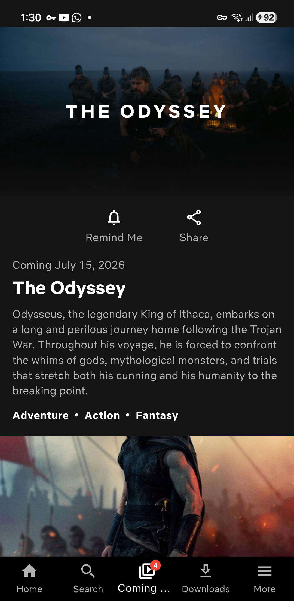

Full detail card per upcoming release: backdrop image, Remind Me/Share actions, formatted release date, synopsis and genre tags pulled from `/movie/upcoming`. The list paginates automatically as you scroll near the bottom.

</td>
<td width="33%">

**Downloads**

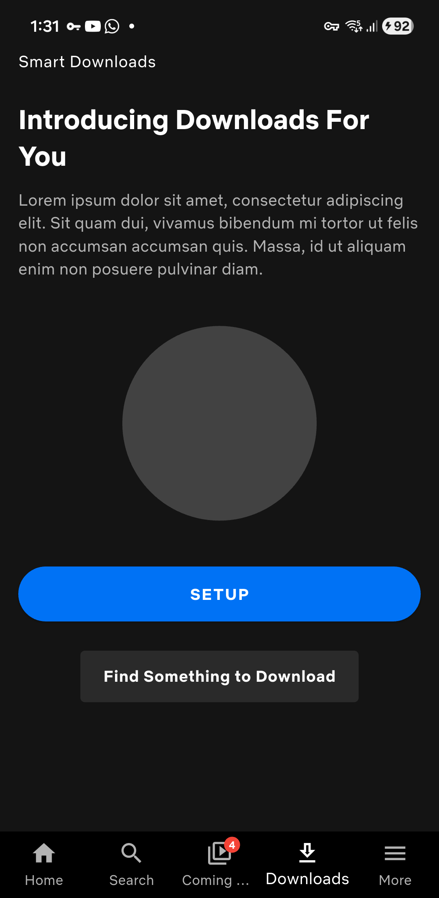

Static "Smart Downloads" promo screen with a Setup call-to-action, matching the reference design (no downloads API was in scope).

</td>
</tr>
<tr>
<td width="33%">

**More**

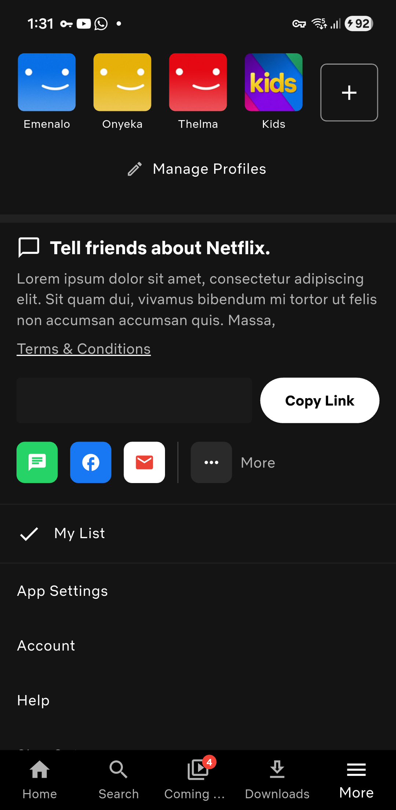

Profile switcher, a referral/share block with social icons, and a settings menu list (My List, App Settings, Account, Help, Sign Out).

</td>
</tr>
</table>

## Demo Video

A short screen recording of the app running end-to-end — navigating Home, searching, and browsing Coming Soon, Downloads and More.

<video src="screenshots/demo.mp4" controls width="300"></video>

*(If the player above doesn't render, download/view the file directly at [`screenshots/demo.mp4`](screenshots/demo.mp4).)*
